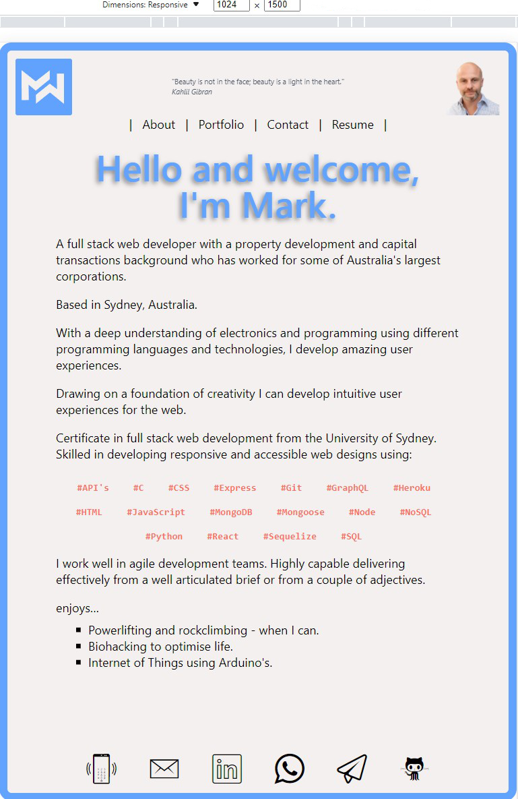
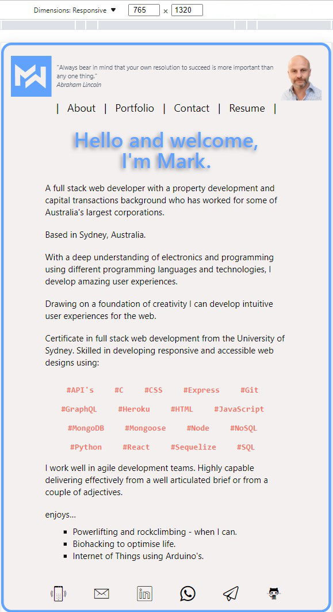
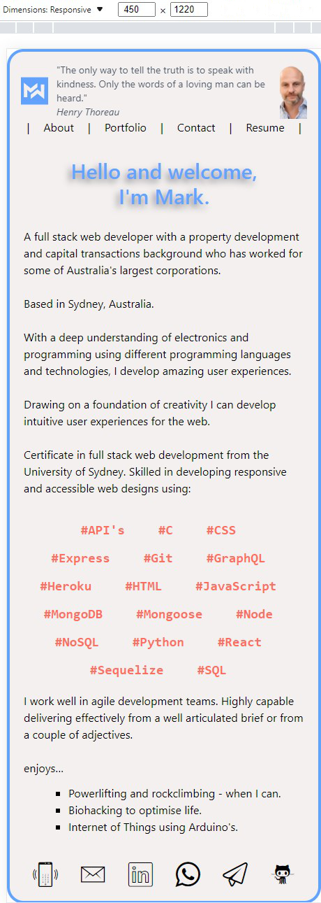

# USYD-FSF Week 20 Project   [](https://get.watsonised.com) [](https://github.com/Mark33Mark/fsf-dev-portfolio-3)  

## React Portfolio

### Table of Contents  
  
   1. [Project Description](#1-description)
   2. [Application Features](#2-features)
   3. [Installation](#3-installation)
   4. [Usage](#4-usage)
   5. [Credits](#5-credits)
   6. [License](#6-license)
   7. [Repository Status](#7-github-repo-status)
   8. [Contribute](#8-how-to-contribute)
   9. [Tests](#9-tests)
   10. [Checklist](#10-checklist)

---

### 1. Description  

**What is this project?**  

*  A portfolio application programmed using the React package, thanks Facebook for developing React.  I now have 2 live versions of my portfolio, you can compare the versions as follows:  
   
   [React:  get.watsonised.com](https://get.watsonised.com)  
   
   or my vanilla JavaScript version    
   [HTML:  hire.watsonised.com](https://hire.watsonised.com)  

*  I'm very new to React.  This was a first project for me where I've tried to mirror my JavaScript version.  It's not an exact mirror, more of an evolution. React is a great package and well worth the commitment to learn as it makes updating / refreshing a lot quicker than having to full code restructures to implement new add ons.  The JavaScript version will be replaced with the React version, including moving the React version to the URL hire.watsonised.com.  This will be done once I've got the form working and completed some styling changes, such as font update and general refinement.  

**Why this project?**  

* As a web developer you're part of a community and a well setup portfolio page is an important place to share your projects and help you with applying for jobs or working as a freelancer but also to share your work with other developers and collaborate on projects.

*  This portfolio demonstrates some of my new React skills to help set me apart from other developers whose portfolios don’t use the latest technologies.

**What problem does this project solve?**  

* Uses current technologies to demonstrate some of my React skills.

**Lessons learnt?**  

* You need to have a good plan to set out the structure / modules for your page.  
* I'd not used Tailwind CSS before but after this project I'm a big fan.  It was reasonably simple to transition from Bootstrap to this.  It is easily configurable, well supported by an excellent on line manual and quick to implement.  
* I couldn't get Netlify to work for the form, I gave it a good try however the form for the moment is not passing through the Netlify server for handling.  Console logs a 405 server error, meaning it gets to the Netlify server but is rejected.  Most likely an issue with the way the data is being sent, I did follow Netlify's walkthrough.  Lesson here is that it wasn't as straightforward as Netlify will have you believe, particularly for React development.
* React is amazingly flexible with how you can handle some processes.  For example this portfolio has 3 different methods for handling icons, Heroicons and Icomoon.  Another example is the many styling methods available.  

---

### 2. Features  

The portfolio satisfies all of the user acceptance criteria as listed in the [Checklist](#10-checklist) below.  


### Responsiveness:  

#### Large Screens



#### Medium Screens



#### Small Screens



---

### 3. Installation

You are welcome to download the source code from [my Github repository](https://github.com/Mark33Mark/fsf-dev-portfolio-3)  

Once downloaded, you will need to install the dependencies with the following command in your terminal:  

```npm install```  

If you want to generate a deploy ready set of minimised (unreadable) code then you will need to run in the command line:  

```npm run build```  

To run the application, type in the command line:

```npm start```  

Enjoy.  

---

### 4. Usage  

The code can be downloaded from [my Github repository](https://github.com/Mark33Mark/fsf-dev-portfolio-3) for all assets created for the project.  

You can modify the code as you need.

---

### 5. Credits  

*  React online documentation,
*  Stack Overflow forums,
*  Tailwind online documentation,
*  https://www.freecodecamp.org/news/build-portfolio-website-react/
*  https://ibaslogic.com/react-tutorial-for-beginners/
*  https://justinramel.com/how-to-use-heroicons-in-your-react-app

---

### 6. License  

 The works in this repository are subject to:  

[](doc/LICENSE.md)

---

### 7. Github repo status  


---

### 8. How to Contribute  

 If you would like to contribute, please comply with the Contributor Covenant Code of Conduct:  

[](doc/code_of_conduct.md)

---

### 9. Tests  

* No unit tests have been written for this application.  

---

### 10. Checklist  

 All actions not checked are still to be completed:  

[x]  Satisfies the acceptance criteria:  
   *   Application is a single-page app for a web developer's portfolio.  
   *   Loading the portfolio, presents the user with a page containing a header, a section for content, and a footer.  
   *   The header has the developer's name and navigation with titles corresponding to different sections of the portfolio.  
   *   The navigation titles, presents the user with the titles: About Me, Portfolio, Contact, and Resume, and the  
title corresponding to the current section is highlighted.
   *  Selecting a navigation title presents the user with the corresponding section below the navigation without the page reloading and that title is highlighted.  
   *  Loading the portfolio for the first time then the About Me title and section are selected by default.  
   *  The About Me has a recent photo or avatar of the developer and a short bio about them.  
   *  The Portfolio section has titled images of six of the developer’s applications with links to both the  
deployed applications and the corresponding GitHub repositories.  
   *  The Contact section has a contact form with fields for a name, an email address, and a message.  
   *  Moving my cursor out of one of the form fields without entering text, a notification that this field is required.  
   *  Entering text into the email address field a notification is issued if an invalid email address is entered.  
   *  The Resume section has a link to a downloadable resume and a list of the developer’s proficiencies  
   *  The footer has text or icon links to the developer’s GitHub and LinkedIn profiles, and their profile on a third platform (Stack Overflow, Twitter).  
[x]  Application must use React to render content.  
[x]  Application has a single Header component that appears on multiple pages, with a Navigation component within it that’s used to conditionally render About Me, Portfolio, Contact, and Resume sections.  
[x]  Application has a single Project component that’s used multiple times in the Portfolio section.  
[x]  Application has a single Footer component that appears on multiple pages.  
[x]  Application is deployed to GitHub Pages, [get.watsonised.com](https://get.watsonised.com)
[x]  Application loads with no errors.  
[x]  Github repository contains application code: [Github location: https://github.com/Mark33Mark/fsf-dev-portfolio-3](https://github.com/Mark33Mark/fsf-dev-portfolio-3)  
[x]  GitHub repo contains all application code.  
[x]  User experience is intuitive and easy to navigate.  
[x]  User interface style is clean and polished.  
[x]  Application uses a color scheme other than the default Bootstrap color palette.  
[x]  Repository has a unique name.  
[x]  Repository follows best practices for file structure and naming conventions.  
[x]  Repository follows best practices for class/id naming conventions, indentation, quality comments, etc.  
[x]  Repository contains multiple descriptive commit messages.  
[x]  Repository contains quality README file with description, screenshot, and link to deployed application.  

---

[Back to the top](#usyd-fsf-week-20-project)  
